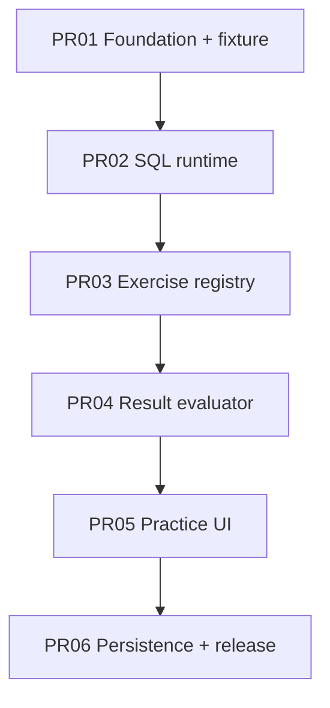

# Dependency Graph



## Contract flow

```text
database bytes ──PR02──> QueryResult
exercise JSON ───PR03──> Exercise
QueryResult + Exercise.evaluation ──PR04──> EvaluationVerdict
all contracts ───PR05──> learner interaction
learner completion ──PR06──> local persisted release
```

## Earliest-defect rule

When a downstream test reveals a defect in an upstream contract, repair the
earliest owning layer. Do not add UI workarounds for engine or evaluator bugs.
